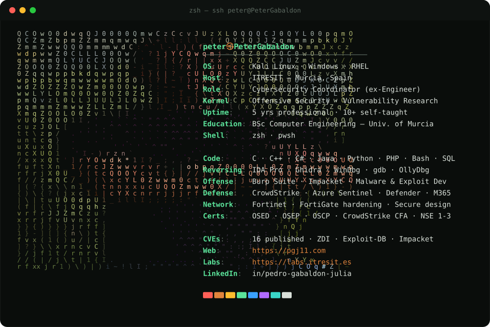

<!--
  Profile README for github.com/PeterGabaldon
  The banner is a static, colored ASCII-art "neofetch" card (profile.svg),
  inspired by github.com/Andrew6rant/Andrew6rant and adapted for security work.
  To regenerate after editing the photo or info panel:
      python assets/generate.py assets/avatar.jpg profile.svg
-->

 

### `Offensive security · Vulnerability research · Malware development`

---

### `whoami`

Computer Engineering graduate (Univ. of Murcia) and Cybersecurity Engineer with 5 years
of professional experience, 10+ in total and mostly self-taught. I build and run security
projects for mid-size and large companies, and support the SOC through forensics and
incident response. On my own time I hunt bugs, reverse binaries and write offensive tooling.
Curiosity is the core of it: the kid who took his toys apart now takes software apart instead.

---

### `Research & projects`

**TeamViewer Kernel Driver LPE** `CVE-2024-7479 / 7481`. User-to-kernel privilege escalation: an unprivileged user could load an arbitrary, attacker-controlled kernel driver on Windows. Found and responsibly disclosed through ZDI (ZDI-24-1289 / 1290). · [PoC](https://github.com/PeterGabaldon/CVE-2024-7479_CVE-2024-7481) · [Finding TeamViewer 0days I](https://pgj11.com/posts/Finding-TeamViewer-0days-Part-1/) · [II](https://pgj11.com/posts/Finding-TeamViewer-0days-Part-2/) · [III](https://pgj11.com/posts/Finding-TeamViewer-0days-Part-3/)

**FortiOS Symlink Persistence Bypass** `CVE-2025-68686`. A symlink-based persistence patch bypass in FortiOS that lets an attacker keep access across the affected configuration boundary, with a checker tool. · [ITRESIT Labs](https://labs.itresit.es/2026/02/11/fortigate-symlink-persistence-method-patch-bypass-cve-2025-68686/) · [pgj11 write-up](https://pgj11.com/posts/FortiGate-Symlink-Attack/) · [Checker tool](https://github.com/I3IT/Fortigate.Symlink.Persistence.Checker)

**CashDro Payment Device Compromise** `CVE-2026-8077 / 8076`. From no auth to full admin on a cash-management device, then extracting money using the same box that is used to deposit it. · [ITRESIT Labs](https://labs.itresit.es/2026/05/07/cashdro-vulnerabilities-from-pentest-to-stealing-money/)

**Summar Employee Portal SQL Injection** `CVE-2025-40677`. Authenticated SQLi in Summar's Employee Portal (< 3.98.0) giving full read/write access to the backend MSSQL database. · [PoC](https://github.com/PeterGabaldon/CVE-2025-40677) · [Exploit-DB 52462](https://www.exploit-db.com/exploits/52462)

**FortiGate VPN-SSL Honeypot**. A Dockerised deception honeypot that mimics FortiGate VPN-SSL devices, traps brute-force attempts, detects deliberately exfiltrated credentials for counter-intelligence, and reports malicious activity to threat-intel feeds (VirusTotal, OTX, AbuseIPDB). · [repo](https://github.com/PeterGabaldon/Fortigate.VPN-SSL.Honeypot)

**WhatAboutSAM**. A custom Windows SAM dumper that reads credentials from the registry (SYSTEM) or, with only local administrator rights, via a Shadow Snapshot, so no SYSTEM is required. · [repo](https://github.com/PeterGabaldon/WhatAboutSAM)

**secretsdump: Shadow Snapshot via WMI** `Impacket PR #1719`. A registry-independent credential-dump method merged into Impacket: create a Shadow Snapshot on the remote host over WMI, then pull SAM, SYSTEM and SECURITY over SMB for offline analysis. · [Impacket PR #1719](https://github.com/fortra/impacket/pull/1719)

**Detect Remote Shadow Snapshot Dump**. The blue-team counterpart: a PoC that uses Event Tracing for Windows (WMI and SMB-Client providers) to detect remote SAM/SYSTEM/SECURITY theft via shadow snapshots, with no code execution on the victim. · [ITRESIT Labs](https://labs.itresit.es/2025/06/11/remote-windows-credential-dump-with-shadow-snapshots-exploitation-and-detection/) · [repo](https://github.com/I3IT/Detect.Remote.ShadowSnapshot.Dump)

**LaborOfficeFree Weak MySQL Root Password** `CVE-2024-1346`. The bundled MySQL root password in LaborOfficeFree 19.10 can be calculated deterministically, granting full access to the database. · [PoC](https://github.com/PeterGabaldon/CVE-2024-1346) · [Exploit-DB 51894](https://www.exploit-db.com/exploits/51894)

**prevent_pth_gpo**. A PowerShell script that automates GPO creation to harden Windows Active Directory against lateral-movement and pass-the-hash techniques. · [repo](https://github.com/PeterGabaldon/prevent_pth_gpo)

**Q12-bot**. A proof-of-concept Python bot that predicts answers for the Q12 live trivia game. · [repo](https://github.com/PeterGabaldon/Q12-bot)

**TrafficWarner Telegram Bot**. A Telegram bot that tracks the journeys you care about and warns you about traffic, using the Google Maps Directions API. · [repo](https://github.com/PeterGabaldon/TrafficWarner-TelegramBot)

**Drive Utility**. A small utility for scripting common Google Drive operations from the command line. · [repo](https://github.com/PeterGabaldon/DriveUtility)

---

### `CVEs`

<code>© Peter Gabaldon Julia · Murcia, Spain</code>

